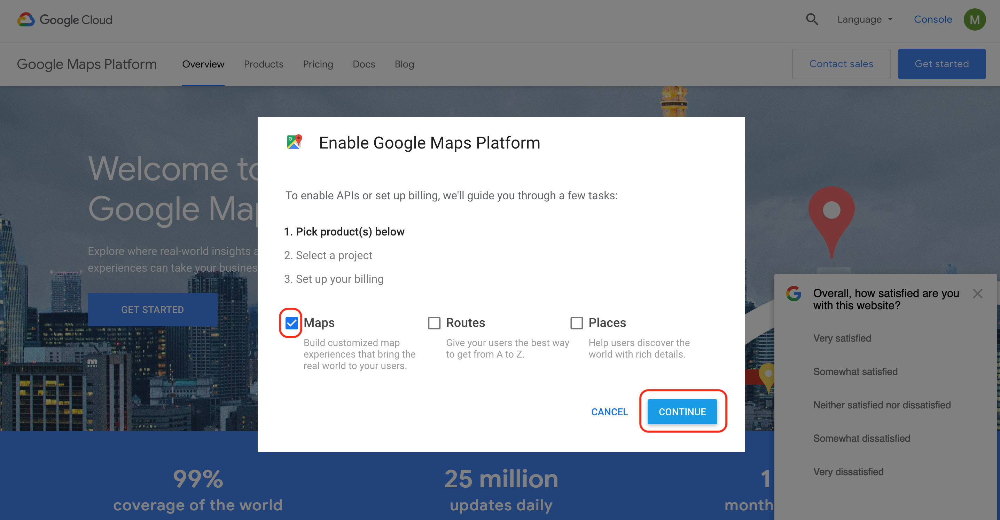
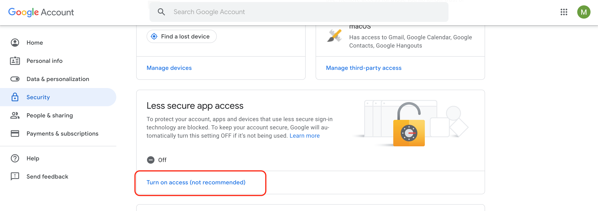

# RouteMe

(https://github.com/AhadCove/routeme/blob/master/assets/routeme-demo.gif)

## Setup Config
First run yarn or npm i
Rename `config.example.js` to `config.js`
Next enter your `email`, `username`, and `password` that you'll be using to listen to the emails and send your the directions inside `config.js`

## Getting your API Key from Google

You'll first want to get an API key for Google Maps here:
https://cloud.google.com/maps-platform/?apis=routes



After your create your API, grab your API Key and enter it into config.js

## Less Secure App Access
Next up so google will allow our server to listen to and send emails we'll have to turn on `Less secure app access`
https://myaccount.google.com/security



## Getting a Google Voice Number:
If you don't already have a google voice number, you'll need one.
https://voice.google.com/calls

After you have your Google Voice number head to the Google Voice settings and make sure that your text are being forwarded to the email that you'll be using
https://voice.google.com/settings

## Run RouteMe
Everything is now setup and ready to run!
Now you can type `yarn` or `npm start` and RouteMe will start running

Send a text message to your `Google Voice number`,
In the first half of the message you'll want to put the `From location`, next you'll type `routeme` and then you'll type the `To location`.

```
Cumberland Mall routeme Georgia Aquarium
```

The locations can be in Name format, address, or coordinates.

```
33.880958, -84.467623 routeme World of Coke
```
Now let your hair down and head off into the world knowing that data can't stop you from going where you want

---

*Disclaimer I can only confirm that the text message portion will work in the US since we're given an `email` that's attached to each one of our phone numbers.
If you don't have an email in your country attached to your phone number you'll have to find some other way to listen to text messages, like `Twillo`*

---

Check out the article about why I created RouteMe on [Medium](https://medium.com/p/9ca51bc912df)

You can also follow me on [Twitter](https://twitter.com/ahadcove) and [Youtube](https://youtube.com/ahadcove) to keep up to date with the rest of my projects.
